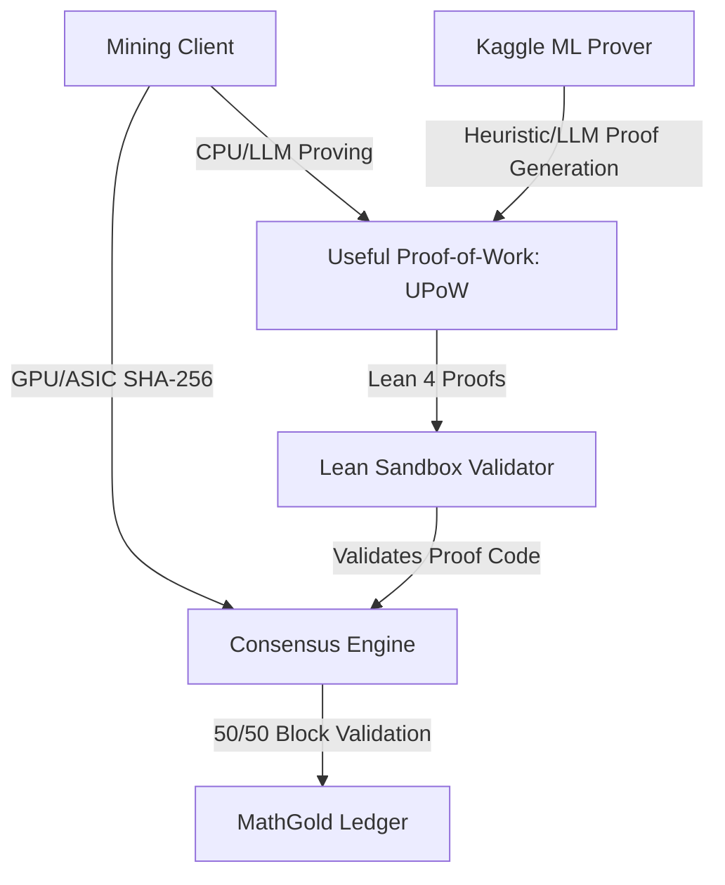

# MathGold: Developer & AI Agent Handover Documentation

Welcome to **MathGold**! This document serves as the master architectural handbook, design log, and next-steps pipeline guide for both human developers and AI coding agents working on the codebase. It details the project's transition from theoretical mathematical formalization to a live, functional hybrid consensus blockchain.

---

## 1. Project Mission & Monetization

*   **The Mission**: Make highly accessible, highly engaging, and highly difficult mathematics free and open to all, forever, via the **MathGod.org** learning platform.
*   **The Monetization Model**: The platform is sustained and monetized via **MathGold**—a hybrid Proof-of-Work (PoW) cryptocurrency designed to replace traditional computationally wasteful hashing with useful mathematical proofs.
*   **Reinvestment**: A contractually locked proportion of MathGold minting fees and block rewards is automatically channeled back into hosting, expanding, and auditing the free MathGod website, curriculum, and theorem-proving infrastructure.

---

## 2. The Project Roadmap: Making MathGold a Reality

To transition from formalizing proofs to executing a real blockchain network, our engineering focus is shifting towards the construction of the actual consensus client, the proof-verification engine, and machine-learning integrations.

### Next Steps for Implementation
1.  **Block Structure & Header Integration**: Design block headers that accept Lean 4 proof hashes and theorem IDs alongside standard SHA-256 nonces.
2.  **Lean Verification Node**: Build a lightweight, sandboxed version of the Lean 4 compiler running inside Docker containers on mining nodes to validate submitted proofs within a strict time limit (~5 seconds per verification).
3.  **Dynamic Difficulty Adjuster**: Formulate the algorithm that dynamically scales proof difficulty based on block time and proof submission rates.
4.  **MathGold Mining Pool API**: Build a JSON-RPC interface allowing miners to lease out computational proving power, fetch active mathematical bounties, and submit valid proofs to the mempool.

---

## 3. The Kaggle Connection: Machine Learning for Automated Proving

To make MathGold UPoW mining competitive, agents and miners must move beyond simple brute-force search. We are leveraging insights from the **Kaggle class this week** to design smarter automated provers:

*   **LLM-Guided Tactical Search**: Fine-tuning lightweight LLMs (like Gemma 2B/7B) to predict the next best Lean tactics (e.g., `omega`, `aesop`, `ring`, `exact`) based on the current goal state.
*   **Proof Difficulty Estimation**: Implementing regression models to predict the computation time and memory footprint of a candidate proof, avoiding out-of-memory errors in the Lean compiler.
*   **Heuristic Search Optimizations**: Using reinforcement learning (RL) to guide tree-search algorithms (such as Monte Carlo Tree Search) over Lean's proof trees, significantly improving solver efficiency for UPoW block rewards.

---

## 4. Current Formalization Portfolio (`MathGoldFormalization/`)

Our consensus mathematical bounds are formalized in Lean 4 within the [MathGoldFormalization copy/](file:///Users/austinanderson/MathGoldTest/MathGoldFormalization%20copy/) directory. The block reward validation is split 50/50:

### Consensus Portfolio Split
| PoW Vector | Allocation | Primary Objective | Key Files |
| :--- | :--- | :--- | :--- |
| **SHA-256 Base Layer** | 50.0% | Guarantees network security, baseline liquidity, and ASIC integration. | N/A |
| **SDECCs (VT Codes)** | 10.0% | Proves optimal bounds for insertion/deletion error correction. | [`VT_Codes.lean`](file:///Users/austinanderson/MathGoldTest/MathGoldFormalization%20copy/MathGoldFormalization/VT_Codes.lean), [`VTlean/`](file:///Users/austinanderson/MathGoldTest/MathGoldFormalization%20copy/MathGoldFormalization/VTlean) |
| **Mersenne Primes** | 10.0% | Discovery of massive prime numbers. | N/A |
| **Counterexamples** | 10.0% | Computational searches to falsify open conjectures (Riemann, Collatz). | N/A |
| **Game Bounds (Chess/Go)** | 10.0% | Solves the exact step-bounds for perfect games. | N/A |
| **Eminent Proposals** | 10.0% | Dynamic mathematical bounties driven by university and expert proposals. | N/A |

### Existing Lean Modules
*   [`GeometricWaste.lean`](file:///Users/austinanderson/MathGoldTest/MathGoldFormalization%20copy/MathGoldFormalization/GeometricWaste.lean): Formalizes the "Waste Factor" theorem (`expected_hashes_geometric`), proving that standard SHA-256 consensus waste grows linearly with difficulty.
*   [`RandomOracle.lean`](file:///Users/austinanderson/MathGoldTest/MathGoldFormalization%20copy/MathGoldFormalization/RandomOracle.lean): Proves the "Brute Force Indifference Theorem" (`random_oracle_brute_force_indifference`), confirming that no heuristic outperforms uniform random selection when querying an idealized hash function.
*   [`VT_Codes.lean`](file:///Users/austinanderson/MathGoldTest/MathGoldFormalization%20copy/MathGoldFormalization/VT_Codes.lean): Implements binary strings (`BinString`), deletion operations (`deleteIdx`), Hamming weights (`weight`), and the Varshamov-Tenengolts checksum (`vtChecksum`).

---

## 5. Guidelines for Future AI Coding Agents

When working on this repository to develop the blockchain client, solver pipelines, or Lean formalizations, adhere to the following rules:

> [!IMPORTANT]
> **Code Preservation & Style Bounds**
> *   Do not write "vibe code" lazily. Always verify mathematical assertions against compiler diagnostics first.
> *   Keep Lean lemmas concise (e.g., under 50 lines) to prevent compiler overflows. Extract complex sub-goals into modular helper theorems.
> *   Maintain compatibility with the central configuration file [mcp_config.json](file:///Users/austinanderson/.gemini/config/mcp_config.json) when connecting agent tools.
> *   Strictly follow the formatting guidelines in [lean_coding_style.md](file:///Users/austinanderson/.gemini/antigravity-ide/knowledge/vaneck_preferences/artifacts/lean_coding_style.md).
