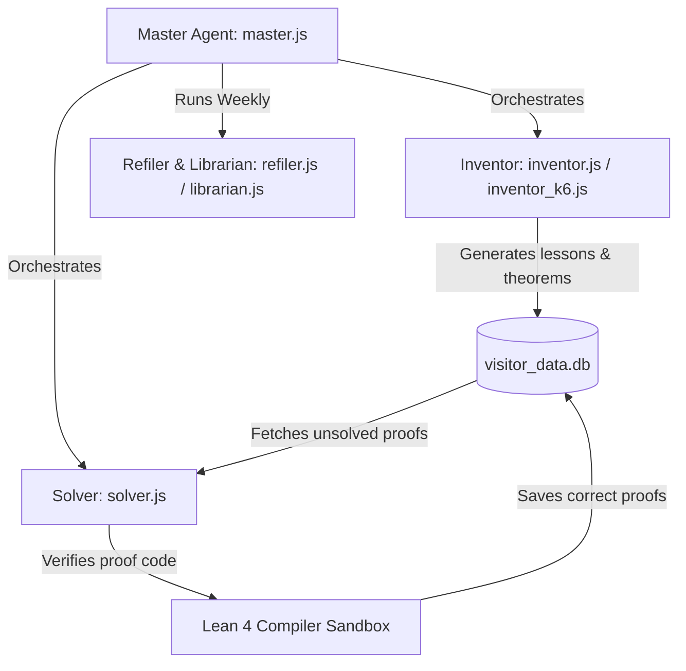

# MathGod: Developer & Agent Handover Documentation

Welcome to **MathGod.org**! This document serves as a comprehensive system architecture description, design log, and pipeline guide for both human developers and AI coding agents working on the codebase.

## 1. Project Mission & Monetization

*   **The Mission**: Make highly accessible, highly engaging, highly difficult mathematics free for all, forever.
*   **The Monetization Model**: Monetized via **MathGold**—a hybrid Proof-of-Work (PoW) cryptocurrency designed to replace traditional computationally wasteful hashing with useful mathematical proofs.
*   **Reinvestment**: A fixed, contractually locked proportion of the MathGold minting fees and block rewards is automatically reinvested back into hosting, expanding, and auditing the free MathGod website and learning tools.

---

## 2. Technical Stack Overview

The project is structured as a full-stack, single-repository monorepo:

*   **Frontend**: Angular v21.0.0 (standalone component architecture, TypeScript, D3.js for interactive mathematical rendering, KaTeX for LaTeX rendering).
*   **Backend**: Node.js Express server (`server.js`) acting as an API provider, static file server, and Lean 4 compiler sandbox interface.
*   **Database**: SQLite3 (`visitor_data.db`) storing routing trees, mathematics lessons, theorem statements, solver attempts, user proof submissions, and game leaderboards.
*   **Proof Verification**: Lean 4 compiler (`lean` and `lake`) integrated server-side, running local verification checks on user-submitted code in a sandboxed command-line process.
*   **AI Pipelines**: Node.js-based autonomous agents (`agents/`) running background tasks, content creation pipelines, and automated Lean theorem proving.

---

## 3. Database Schema (`visitor_data.db`)

The database coordinates the application tree, user proofs, and statistics:

*   `visitors`: Tracks unique visitors via IP hashing (`ip_hash`) for ranking and analytics.
*   `page_stats`: Tracks page-view counts (`view_count`) mapped by `page_id`.
*   `nodes`: Represents a nested tree structure for files and folders mapping the curriculum (Chapters, Sections, Challenges, Exercises).
    *   Columns: `id`, `parent_id`, `name`, `type` ('folder' | 'file'), `file_path`.
*   `theorems`: Stores formal mathematics theorem statements, their parent nodes, and progress indicators.
    *   Columns: `id`, `node_id`, `name`, `statement`, `difficulty`, `is_solved`, `attempts`, `is_false_conjecture`.
*   `submissions`: Records all solver attempts (both human and AI) that successfully verify against the Lean 4 compiler.
    *   Columns: `id`, `theorem_id`, `proof_code`, `solver_nickname`, `is_ai`, `feeling`, `timestamp`.
*   `game_fame`: Leaderboard entries for integrated games (`snakey` and `flight`).
    *   Columns: `id`, `name`, `score`, `level`, `timestamp`, `game`.

---

## 4. Frontend Application Structure (`src/app/`)

The application routing (`app.routes.ts`) exposes several core pages, interactive math tools, and gamified scenarios:

### Core Pages
*   **Home** (`home/`): Landing page containing the global search bar, visitor stats, public IP lookup, and the empty set easter egg node (`∅` linking to `/play-vt`).
*   **Learn** (`learn/`): Tree-view navigator rendering the lessons, active theorems, and Monaco Code Editor for writing Lean 4 proofs.
*   **Work** (`work/`): Code submission overview showing leaderboard stats, solved vs unsolved tasks, and the global Hall of Fame.
*   **Logs** (`logs/`): Real-time output feed of backend system processes, server outputs, and AI solver workflows.

### Mathematical Interactive Tools
*   **Brennan Boundary** (`brennan/`): Dynamic visualizer rendering conformal mappings, complex boundary metrics, and analytic subsets.
*   **Mandelbrot Iterator** (`mandelbrot-iterator/`): Fractal explorer simulating plant-like structures and iterating complex bounds.
*   **Harmonic Walker** (`harmonic-walker/`): Walkthrough rendering harmonic progressions, probability vectors, and infinite step limits.
*   **Complex Plots & Dots** (`complex-plots/`, `complex-dots/`): Interactive visualizers mapping functions over complex planes.
*   **AS815 Flight Predictor** (`flight-predictor/`): 
    *   **The Concept**: A mathematical simulator modeling Alaska Airlines Flight 815 from San Diego (SAN) to Honolulu (HNL).
    *   **The Math**: Players bet their bankroll on the flight duration interval $[T_{\text{min}}, T_{\text{max}}]$. A Normal Distribution PDF/CDF computes the expected arrival time under fluctuating jet stream headwinds ($35\text{--}100 \text{ knots}$) and departure delays:
        $$\text{Multiplier} = \frac{0.95}{\Phi\left(\frac{T_{\text{max}} - \mu_t}{\sigma_t}\right) - \Phi\left(\frac{T_{\text{min}} - \mu_t}{\sigma_t}\right)}$$
        The standard deviation collapses over flight progress $p \in [0, 1]$ as a function of remaining uncertainty: $\sigma_t = \sqrt{1 - p} \cdot \sigma$.
    *   **Visuals**: Built with custom D3 SVG rendering mapping the Great Circle route, live wind vector currents, and real-time normal distribution curves.
*   **Snakey** (`snakey/`):
    *   **The Concept**: An implementation of Harary's generalized mathematical Tic-Tac-Toe on an infinite grid where "Maker" tries to construct a specific polyomino (e.g. Tetromino O, Pentomino F, or Hexomino Snakey) and "Breaker" tries to block it.
    *   **The Strategy**: Implements Breaker's optimal pairing strategy based on mathematical paving. A Paving function acts as an involution:
        $$\text{Paving}(\text{Paving}(g)) = g$$
        Under optimal pairing, Breaker guarantees Maker cannot win for Pentomino F on an infinite grid.
    *   **VT Color Generation**: Employs a 5-bit Varshamov-Tenengolts (VT) checksum computed on the day of the month ($d \in [1, 31]$) to assign unique, non-colliding default colors to the two players:
        $$S(n) = \sum_{i=0}^{4} (i+1) \cdot \left(\lfloor \frac{n}{2^i} \rfloor \bmod 2\right)$$
        For player 2, the day value is inverted: $n_2 = {\sim}n_1 \bmod 32$. Modulo 12 calculations are proved in Lean (`VT_no_collision`) to guarantee that $S(n_1) \bmod 12 \neq S(n_2) \bmod 12$, ensuring the players never get the same color.

---

## 5. AI Agent Pipeline (`agents/`)

The project utilizes automated AI agents that live in the repository and actively develop, maintain, and solve the math exercises.



### The Master Agent (`master.js`)
*   Runs daily and controls the scheduling state (`schedule_state.json`).
*   Alternates development focus between the **Human Curriculum** (OpenStax Prealgebra) and the **K-6 Curriculum**.
*   Within each curriculum, it checks node ratios to decide whether to write textbook chapters (**Text** mode) or generate tasks (**Exercises** mode).
*   Triggers the automated **Solver** to clear out any unsolved theorem backlogs.
*   Triggers **Refiler** and **Librarian** weekly (Sundays) to reorganize database entries and folder structures.

### The Inventors (`inventor.js` & `inventor_k6.js`)
*   Utilize `gemini-3.1-pro-preview` to write natural language lessons inside Lean docstrings (`/-! ... -/`) and formalize basic mathematical definitions.
*   Save the textbook contents directly into the `theorems` database table with an interactive capped difficulty score.
*   Randomly generate advanced challenges (e.g. Propositional Logic, Number Theory, Abstract Algebra, and Point-set Topology).

### The Solver (`solver.js`)
*   Selects fresh unsolved theorems from the database.
*   Uses `gemini-2.5-pro` in a multi-attempt loop (maximum 3 tries) to write full, compilable Lean 4 proofs.
*   Runs proposed code through the local Lean compiler.
*   If the compiler returns no errors, the solver logs the success, stores the proof in `submissions`, and marks the theorem as solved.
*   If compilation fails, it feeds the compiler error back into the model context to self-correct on the next attempt.

### Maintenance Agents (`refiler.js` & `librarian.js`)
*   Clean up orphaned database references, rebuild index hierarchies, check file path validity, and maintain the sanity of the project navigation trees.

---

## 6. MathGold Formalization (`MathGoldFormalization/`)

The Proof-of-Work portfolio is mathematically formalized in Lean 4 within the `MathGoldFormalization/` directory:

### Consensus Portfolio Split
The blockchain splits block reward validation 50/50:
1.  **50% Cryptographic Base Layer (SHA-256)**: Economically secures the network and guarantees ASIC-supported Sybil resistance.
2.  **50% Useful Proof-of-Work (UPoW)**: Dedicates computing to math proof discovery, partitioned into:
    *   **Symmetric Deletion Error-Correcting Codes (SDECCs / VT Codes)** (10%)
    *   **Prime Hunting / Mersenne Verification** (10%)
    *   **Conjecture Counterexamples** (Collatz, Euler, Riemann) (10%)
    *   **Perfect Game Trees** (Chess & Go bounds) (10%)
    *   **The Mathematician's Proposal Fund** (Dynamic Research Bounties) (10%)

### Lean Formalization Modules
*   [`GeometricWaste.lean`](file:///Users/austinanderson/AngularMathgod/MathGoldFormalization/MathGoldFormalization/GeometricWaste.lean): Formalizes the "Waste Factor" theorem (`expected_hashes_geometric`), proving that the expectation value of discarded hashing trials under standard SHA-256 consensus grows linearly as difficulty increases.
*   [`RandomOracle.lean`](file:///Users/austinanderson/AngularMathgod/MathGoldFormalization/MathGoldFormalization/RandomOracle.lean): Proves the "Brute Force Indifference Theorem" (`random_oracle_brute_force_indifference`), confirming that no heuristic search pattern can outperform uniform random selection when querying an idealized hash function (Random Oracle).
*   [`VT_Codes.lean`](file:///Users/austinanderson/AngularMathgod/MathGoldFormalization/MathGoldFormalization/VT_Codes.lean): Implements binary strings (`BinString`), 1-deletions (`deleteIdx`), Hamming weights (`weight`), zero weights (`zeroWeight`), and the full Varshamov-Tenengolts checksum (`vtChecksum`). Proves the shift lemma and additive concatenation properties required for single-deletion error correction.
*   [`VTlean/`](file:///Users/austinanderson/AngularMathgod/MathGoldFormalization/MathGoldFormalization/VTlean): Contains a massive library of advanced proofs (`Optimal_VTCode.lean`, `Optimal.lean`, `InsDel.lean`) establishing optimal mathematical bounds on insertion/deletion ratios.

---

## 7. Core Verification & API Mechanics

### Compiler Endpoint (`/api/lean`)
*   Receives raw Lean code via HTTP POST.
*   Writes code to a temporary file (`temp_[timestamp].lean`).
*   Resolves environment paths (supports both macOS and AWS EC2 server directories).
*   Determines if standard imports are used (e.g. `import Mathlib`). If Mathlib is required, the command compiles via the project package manager:
    ```bash
    lake env lean temp_xyz.lean
    ```
    Otherwise, it invokes the raw compiler to save overhead:
    ```bash
    lean temp_xyz.lean
    ```
*   Returns any stdout or stderr. If both outputs are completely empty, the backend considers the proof verified and returns: `"No errors. Proof correct!"`.
*   Includes a safety timeout (300 seconds on server, 90 seconds on local runs) to prevent infinite loops or out-of-memory crashes during verification.

### Anti-Cheat Signature Locking (`/api/submit`)
*   To prevent users or automated provers from bypassing math challenges by changing theorem statements, the submission route matches the incoming payload against the original database statement.
*   Uses a strict regex lookup on the theorem keyword and arguments:
    ```regex
    /^([\s\S]*?)(theorem|lemma)\s+([a-zA-Z0-9_.]+)(.*?):\s*([\s\S]+?)\s*:=\s*by\s*\{/m
    ```
*   Ensures that imports, variables, and the negated theorem statement (in the case of rebuttals/debunkers) have not been modified. Altering these signatures triggers an immediate HTTP 403 response.

---

## 8. Onboarding Guidelines for Future Agents

When writing code, solving proofs, or modifying components in this repository, follow these rules:

1.  **Do Not "Vibe Code" Lazily**: Avoid arbitrary patches. Read the mathematical assertions, verify against compiler diagnostics first, and make structural changes based on concrete proofs.
2.  **Lean Style Limits**: Maintain local bounds when writing Lean 4 lemmas. Keep helper theorems concise (e.g., under 50 lines) to avoid compiler buffer overflows. Use exact constructors like `abbrev` over custom definitions, and rely on `rfl` or the `omega` tactic for arithmetic.
3.  **Local Dev Execution**:
    *   Start the Express server and Angular client in parallel:
        ```bash
        npm run dev
        ```
    *   Ensure a local Lean 4 project is initialized in your home directory (`~/mathgod_lean`) or inside the root folder to handle `/api/lean` requests correctly.
4.  **Database Syncing**: When changing or creating theorems, double-check that the entry in the `nodes` table matches the structural directory file structure, and that the `theorems` table matches the exact signature string required for Anti-Cheat verification.
